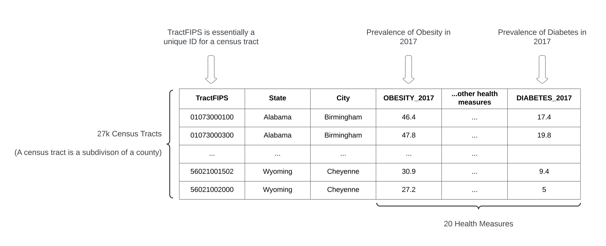
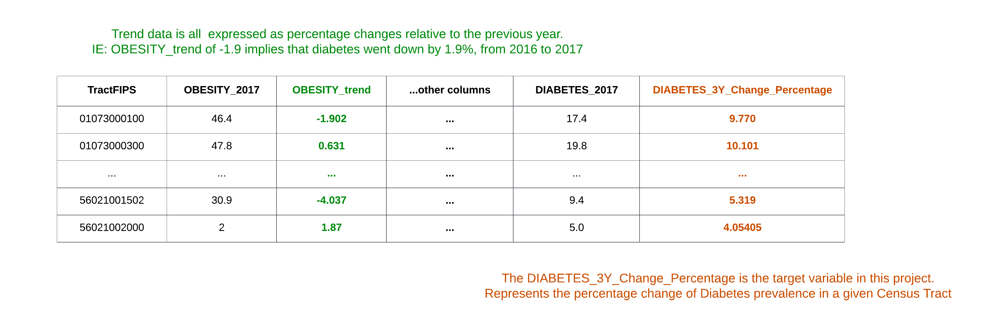

# Objective

The goal of this project is to use various leading indicators to try predicting the diabetes rate of a population in the future. The leading indicators used in this project include health census data from the CDC, as well as unemployment data from the USDA.

# Motivation

I hope that this could be a useful tool for local governments to be able to anticipate the rising importance of healthcare funding -- and perhaps take measures to improve the health of their people.

# [Training Data Assembly (notebook link)](./Data_Processing/2017_Health_Data.ipynb)

The basis of the training data comes from the results of a 2017 CDC census, which has health measurements of ~27k Census Tracts (essentially subdivisions of counties.) These measurements include estimated incidence rates of various issues like Diabetes, COPD, and drinking. The original dataset has 1 row per health measure per census tract (500k rows). To make the basis of the training data, I aggregated the information from each census tract, in order to represent it in a single row.

# [Health Trend Calculation (notebook link)](./Data_Processing/Health_Trends.ipynb)

Past health trend data was generated using a similar census from 2016. The purpose of this was to quantify which direction health measurements were going in. For example, if the 2016 obesity rate was 10%, and the 2017 obesity rate was 15%, this would represent 50%. In this project, "trend" is synonymous with percentage change.

# [Unemployment Trend Calculation](./Data_Processing/Poverty_Data_Joining.ipynb)

The USDA has a dataset of various County-level economic metrics, spanning 2000-2021. This was used in a similar fashion as the Health Trend data. The 2017 unemployment data is captured as a feature, along with the trend from 2016. For example, if the unemployment rate of a given county was 2% in 2016 and 3% in 2017, this would represent a trend of 0.5. One difference from the health trend data is that the unemployment data is on a County-scale. This means that census tracts belonging to the same county would have the same unemployment statistics.

# Target Variable Calculation

The goal of this project is to use data from 2016 and 2017 to predict how the diabetes rate of a given area will change in the next 3 years. This target variable is calculated by using the diabetes rate in the 2020 CDC data, and comparing it against the diabetes rate in 2017 in the corresponding area.

# Target Variable Distribution

Among the ~27k census tracts, Diabetes Prevalence rates increased by 0.014 on average between 2017 and 2020. The distribution seems to be pretty heavily concentrated towards the middle, although there are a good amount of areas that saw more than a 10% change (both up and down).

# Modeling

## Random Forest

The first model type I experimented with was Random Forest. I chose Random Forest because of its high interpretability -- I was very interested in seeing which features helped the model the most. I chose hyperparameters by using [grid search with cross validation](./Modeling/RandomForest_GridSearchCV.ipynb).

Predicted vs Actual for both train and validation:

## Random Forest Feature Importances

# Datasets

[2017 CDC Census Results](https://chronicdata.cdc.gov/500-Cities-Places/500-Cities-Local-Data-for-Better-Health-2019-relea/6vp6-wxuq)

[2020 CDC Census Results](https://chronicdata.cdc.gov/500-Cities-Places/PLACES-Local-Data-for-Better-Health-Census-Tract-D/cwsq-ngmh)

[USDA Unemployment Data](https://www.ers.usda.gov/data-products/county-level-data-sets/county-level-data-sets-download-data/)

# Related knowledge

[Understanding Census FIPS codes](https://www.census.gov/programs-surveys/geography/guidance/geo-identifiers.html\)