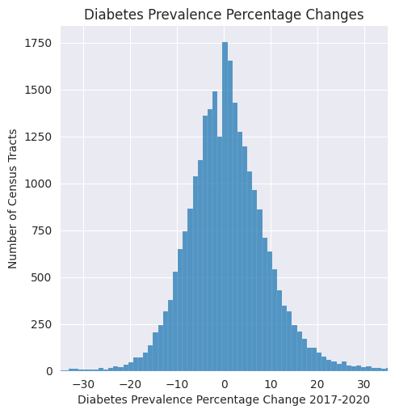

# Objective

The goal of this project is to use various leading indicators to try predicting the diabetes rate of a population in the future. The leading indicators used in this project include health census data from the CDC, as well as unemployment data from the USDA.

# Motivation

I hope that this could be a useful tool for local governments to be able to anticipate the rising importance of healthcare funding -- and perhaps take measures to improve the health of their people.

# [Training Data Assembly (notebook link)](./Data_Processing/2017_Health_Data.ipynb)

The basis of the training data comes from the results of a 2017 CDC census, which has health measurements of ~27k Census Tracts (essentially subdivisions of counties.) These measurements include estimated incidence rates of various issues like Diabetes, COPD, and drinking. The original dataset has 1 row per health measure per census tract (500k rows). To make the basis of the training data, I aggregated the information from each census tract, in order to represent it in a single row.

# [Health Trend Calculation (notebook link)](./Data_Processing/Health_Trends.ipynb)

Past health trend data was generated using a similar census from 2016. The purpose of this was to quantify which direction health measurements were going in. For example, if the 2016 obesity rate was 10%, and the 2017 obesity rate was 15%, this would represent 50%. In this project, "trend" is synonymous with percentage change.

# [Unemployment Trend Calculation](./Data_Processing/Poverty_Data_Joining.ipynb)

The USDA has a dataset of various County-level economic metrics, spanning 2000-2021. This was used in a similar fashion as the Health Trend data. The 2017 unemployment data is captured as a feature, along with the trend from 2016. For example, if the unemployment rate of a given county was 2% in 2016 and 3% in 2017, this would represent a trend of 0.5. One difference from the health trend data is that the unemployment data is on a County-scale. This means that census tracts belonging to the same county would have the same unemployment statistics.

# Health Measures

These are the health measures that were present in both the 2016 and 2017 census. As described above, "\<measure>\_trend" refers to the percentage change between 2016 and 2017. I hope that the models can take these trends into account to improve predictions. 

| Health Measure ID        | Description                                                                             |
|------------|-------------------------------------------------------------------------------------------------------|
| ACCESS2    | Current lack of health insurance among adults aged 18–64 Years                                        |
| ARTHRITIS  | Arthritis among adults aged >=18 Years                                                                |
| BINGE      | Binge drinking among adults aged >=18 Years                                                           |
| BPHIGH     | High blood pressure among adults aged >=18 Years                                                      |
| BPMED      | Taking medicine for high blood pressure control among adults aged >=18 Years with high blood pressure |
| CANCER     | Cancer (excluding skin cancer) among adults aged >=18 Years                                           |
| CASTHMA    | Current asthma among adults aged >=18 Years                                                           |
| CHD        | Coronary heart disease among adults aged >=18 Years                                                   |
| CHECKUP    | Visits to doctor for routine checkup within the past Year among adults aged >=18 Years                |
| CHOLSCREEN | Cholesterol screening among adults aged >=18 Years                                                    |
| COPD       | Chronic obstructive pulmonary disease among adults aged >=18 Years                                    |
| CSMOKING   | Current smoking among adults aged >=18 Years                                                          |
| DIABETES   | Diagnosed diabetes among adults aged >=18 Years                                                       |
| HIGHCHOL   | High cholesterol among adults aged >=18 Years who have been screened in the past 5 Years              |
| KIDNEY     | Chronic kidney disease among adults aged >=18 Years                                                   |
| LPA        | No leisure-time physical activity among adults aged >=18 Years                                        |
| MHLTH      | Mental health not good for >=14 days among adults aged >=18 Years                                     |
| OBESITY    | Obesity among adults aged >=18 Years                                                                  |
| PHLTH      | Physical health not good for >=14 days among adults aged >=18 Years                                   |
| STROKE     | Stroke among adults aged >=18 Years                                                                   |

# Target Variable Calculation

The goal of this project is to use data from 2016 and 2017 to predict how the diabetes rate of a given area will change in the next 3 years. This target variable is calculated by using the diabetes rate in the 2020 CDC data, and comparing it against the diabetes rate in 2017 in the corresponding area.

# Target Variable Distribution

Among the ~27k census tracts, Diabetes Prevalence rates increased by 1.4% on average between 2017 and 2020. The distribution seems to be pretty heavily concentrated towards the middle, although there are a good amount of areas that saw more than a 10% change (both up and down).

# Modeling

## Baseline Model

I used [Linear Regression](./Modeling/LinearRegression.ipynb) as the baseline model. The average r2 score obtained through cross validation was **0.14**. Hopefully the later models will be able to perform better.

## [Random Forest](./Modeling/RandomForest.ipynb)

The first complex model type I experimented with was Random Forest. I chose Random Forest because of its high interpretability -- I was very interested in seeing which features helped the model the most. I chose hyperparameters by using grid search with cross validation. Using these hyperparameters, the Random Forest model was able to get a validation r2 score of **~0.243**. Hopefully this can be improved with further feature engineering.

## Random Forest Feature Importances

The trend in adults taking blood pressure medication (BPMED_trend) was the strongest leading indicator of diabetes prevalence. This does make a lot of sense, as increased blood pressure is a sign of cardiovascular issues. It makes sense that both DIABETES_2017 and DIABETES_trend scored highly in terms of feature importances.

## [XGBoost](./Modeling/XGBoost.ipynb)

I then tried XGBoost, another tree based model. I was curious to see how it would perform compared to the Random Forest. I again chose hyperparameters using grid search with cross validation. XGBoost with the tuned hyperparameters achieved an average cross validation r2 score of **0.221**, slightly lower than Random Forest.

## XGBoost Feature Importances

## [Neural Network](./Modeling/NeuralNetwork.ipynb)

I also tried tackling this problem with neural networks. I used [grid search for hyperparameter tuning](./Modeling/NeuralNetwork_GridSearch.ipynb). The best validation-r2 score I was able to get was around ~0.25, slightly beating out both of the tree-based approaches.

I will later use SHAP values to understand what features the neural network found to be important.

## Findings

The feature importances from both of the tree based models was readily accessible. I thought that it was very interesting that Asthma prevalences was considered a strong leading indicator by both models. Maybe when people get Asthma, it becomes harder for them to exercise, thus leading to increased Diabetes prevalence. It could also just be strongly correlated with general cardiovascular health.

According to a [study done in 2019](https://pubmed.ncbi.nlm.nih.gov/25635985/), air pollution has been found to be stronglly associated with type 2 diabetes. I plan to join in air quality information from the EPA, to see if the models can be further improved. Stay tuned!

# Datasets

[2017 CDC Census Results](https://chronicdata.cdc.gov/500-Cities-Places/500-Cities-Local-Data-for-Better-Health-2019-relea/6vp6-wxuq)

[2020 CDC Census Results](https://chronicdata.cdc.gov/500-Cities-Places/PLACES-Local-Data-for-Better-Health-Census-Tract-D/cwsq-ngmh)

[USDA Unemployment Data](https://www.ers.usda.gov/data-products/county-level-data-sets/county-level-data-sets-download-data/)

# Related knowledge

[Understanding Census FIPS codes](https://www.census.gov/programs-surveys/geography/guidance/geo-identifiers.html\)